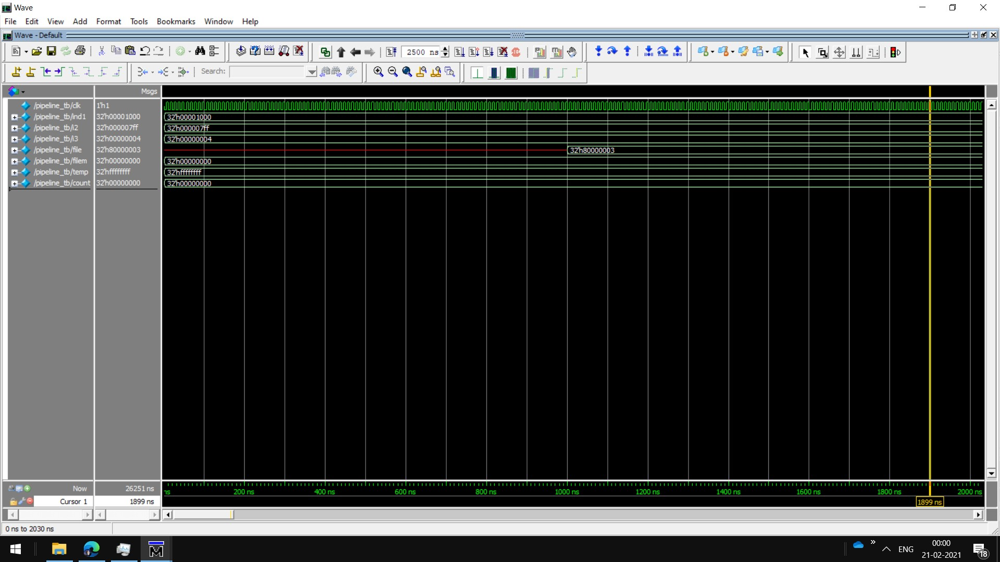

# RISC-Pipelined-Processor-32-bit-Verilog
Simple Pipelined 32 bit RISC Processor 
[Pipelined RISC Processor](pipeline_risc.jpg)

<h2>Reference</h2>
<h3>[1]Basic Idea:https://www.eg.bucknell.edu/~csci320/2014-fall/#!single.md</h3>
